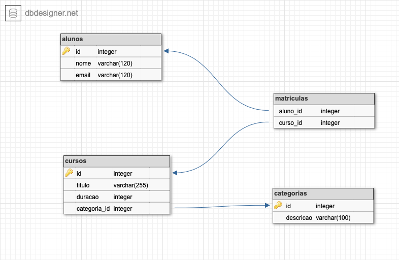

<div align="center" id="top"> 
  

  &#xa0;
</div>

<h1 align="center">#NãoDurmaComEssa - Banco Dados</h1>

<!-- Status -->

## Comandos básicos

### Manipular base de dados

#### Criar base

```sql
CREATE DATABASE gama;
```

#### Remover base

```sql
DROP DATABASE gama;
```

#### Criar tabela
```sql
CREATE TABLE aluno (
  id INT NOT NULL AUTO_INCREMENT,
  nome VARCHAR(120) NOT NULL,
  PRIMARY KEY (id);
);
```

#### Alterar tabela
```sql
ALTER TABLE aluno 
  ADD email VARCHAR(120) NOT NULL
    AFTER id;
```

### Remover tabela
```sql
DROP TABLE aluno;
```

## Desafio mão na massa
### O que será desenvolvido:

Iremos desenvolver um CRUD de alunos, cursos e categorias, também iremos implementar alguns conceitos de relacionamento conforme imagem a seguir.



Esse diagrama foi desenvolvido utilizando a ferramenta <a href="https://app.dbdesigner.net/designer" target="_parent">DBDesigner</a> que permite modelar e gerar os scripts de criação das tabelas.

<br />

### Tipos de relacionamento
Antes de mais nada é importante sabermos os tipos de relacionamentos que iremos utilizar:

<table>
  <thead>
    <th>Tipo de relacionamento</th>
    <th>Descrição</th>
  </thead>
  <tbody>
    <tr>
      <td>**Não utilizado** <br /><br />
      Um para um</td>
      <td>Em um relacionamento um para um, um registro em uma tabela está associado a um e somente um registro em outra tabela. <br /><br />
      Por exemplo, em um banco de dados escolar, cada aluno tem somente um ID do aluno e cada ID do aluno é atribuído a somente uma pessoa.</td>
    </tr>
    <tr>
      <td>Um para muitos</td>
      <td>Em um relacionamento um para muitos, um registro em uma tabela está associado a um ou mais registros em outra tabela. <br /> <br />
      Por exemplo, cada categoria pode ter muitos cursos.</td>
    </tr>
    <tr>
      <td>Muitos para muitos</td>
      <td>Um relacionamento muitos para muitos ocorre quando vários registros em uma tabela são associados a vários registros em outra tabela. <br /> <br />
      Por exemplo, um relacionamento muitos para muitos existe entre alunos e cursos: alunos podem se matrícular em vários cursos e cursos podem ser cursados por muitos alunos.</td>
    </tr>
  </tbody>
</table>

### Execução

Antes de mais nada iremos criar o nosso banco de dados chamado `gama` com o seguinte comando:

```sql
CREATE DATABASE gama;
```

Também temos que selecionar o banco recém criado para uso com o comando:

```sql
USE gama;
```

Agora seguem os scripts na sequência em que as tabelas deverão serem criadas:

1. Tabela `alunos`
```sql
CREATE TABLE alunos (
	id INT NOT NULL AUTO_INCREMENT,
	nome varchar(120) NOT NULL,
	email varchar(120) NOT NULL,
	PRIMARY KEY (id)
);
```

2. Tabela `categorias`
```sql
CREATE TABLE categorias (
	id INT NOT NULL AUTO_INCREMENT,
	descricao varchar(100) NOT NULL UNIQUE,
	PRIMARY KEY (id)
);
```

3. Tabela `cursos`
```sql
CREATE TABLE cursos (
	id INT NOT NULL AUTO_INCREMENT,
	titulo varchar(255) NOT NULL,
	duracao INT NOT NULL,
	categoria_id INT NOT NULL,
	PRIMARY KEY (id)
);
```

3. Tabela `matriculas`
```sql
CREATE TABLE matriculas (
	id INT NOT NULL AUTO_INCREMENT,
	aluno_id INT NOT NULL,
	curso_id INT NOT NULL,
    PRIMARY KEY (id)
);
```

Nesse momento temos todas as tabelas conforme definidas no diagrama, mas ainda nos falta criar as `constraints` que conforme a própria definição no site do `MySQL` é:
> As Restrições são regras aplicadas nas colunas de uma tabela. São usadas para limitar os tipos de dados que são inseridos.

Agora que sabemos o que são `constraints` segue tabela das principais constraints no `MySQL`.
<br />

<table>
  <thead>
    <th>Constraint</th>
    <th>Descrição</th>
  </thead>
  <tbody>
    <tr>
      <td>NOT NULL</td>
      <td>
      - A constraint NOT NULL impõe a uma coluna a NÃO aceitar valores NULL. <br/><br/>
      - Ou seja, a constraint NOT NULL obriga um campo a sempre possuir um valor. <br/><br/>
      - Deste modo, não é possível inserir um registro (ou atualizar) sem entrar com um valor neste campo.
      </td>
    </tr>
    <tr>
      <td>UNIQUE</td>
      <td>- A restrição UNIQUE identifica de forma única cada registro em uma tabela de um banco de dados. <br/><br/>
      - As constraints UNIQUE e PRIMARY KEY garantem a unicidade em uma coluna ou conjunto de colunas.<br/><br/>
      - Uma constraint PRIMARY KEY automaticamente possui uma restrição UNIQUE definida, portanto não é necessário especificar essa constraint neste caso.<br/><br/>
      - É possível termos várias constraints UNIQUE em uma mesma tabela, mas apenas uma Chave Primária por tabela (lembrando que uma PK pode ser composta, ou seja, constituída por mais de uma coluna – mas ainda assim, será uma única chave primária).</td>
    </tr>
    <tr>
      <td>PRIMARY KEY</td>
      <td>- A restrição PRIMARY KEY (Chave Primária) identifica de forma única cada registro em uma tabela de banco de dados.<br/><br/>
      - As Chaves Primárias devem sempre conter valores únicos.<br/><br/>
      - Uma coluna de chave primária não pode conter valores NULL<br/><br/>
      - Cada tabela deve ter uma chave primária e apenas uma chave primária.</td>
    </tr>
    <tr>
      <td>FOREIGN KEY</td>
      <td>-Uma FOREIGN KEY (Chave Estrangeira) em uma tabela é um campo que aponta para uma chave primária em outra tabela. Desta forma, é usada para criar os relacionamentos entre as tabelas no banco de dados.</td>
    </tr>
  </tbody>
</table>

Agora que temos a definição das `constraints`, podemos perceber que já temos algumas delas definidas na criação das tabelas, como por exemplo `PRIMARY KEY` e `UNIQUE`.

1. Adicionando relacionamento de `cursos` com `categorias`:
```sql
ALTER TABLE cursos ADD CONSTRAINT cursos_fk0 FOREIGN KEY (categoria_id) REFERENCES categorias(id);
```

2. Adicionando relacionamento de `matriculas` com `alunos` e `cursos`:
```sql
ALTER TABLE matriculas ADD CONSTRAINT matriculas_fk0 FOREIGN KEY (aluno_id) REFERENCES alunos(id);
ALTER TABLE matriculas ADD CONSTRAINT matriculas_fk1 FOREIGN KEY (curso_id) REFERENCES cursos(id);
```

3. Por fim criando uma constraint `UNIQUE` composta, onde o aluno só poderá matricular uma vez em cada curso:
```sql
ALTER TABLE matriculas ADD CONSTRAINT matriculas_unique UNIQUE (aluno_id, curso_id);
```

### Inserção de registros

Agora que temos nossa estrutura de banco criada, segue comandos para incluirmos registros.

1. Inserir categorias:
```sql
INSERT INTO categorias (descricao) VALUES ("Tecnologia"), ("Humanas"), ("Análise");
```

2. Inserir alunos:
```sql
INSERT INTO alunos (nome, email) VALUES ("Francis", "francis@teste.com"), ("Maria", "maria@teste.com");
```

3. Inserir cursos:
```sql
INSERT INTO cursos (titulo, duracao, categoria_id) VALUES ("Hackers", 4, 1), ("People", 3, 2), ("ADS", 6, 3);
```

4. Matricular alunos:
```sql
INSERT INTO matriculas (curso_id, aluno_id) VALUES (1, 1), (2, 2), (2, 3);
```

### Seleção dos dados
Agora que temos nossos dados inseridos, iremos realizar alguns exercícios de seleção dos dados.

> Um JOIN é um meio de combinar colunas de uma (auto-junção) ou mais tabelas, usando valores comuns a cada uma delas. O SQL padrão ANSI especifica cinco tipos de JOIN: INNER JOIN, LEFT JOIN, RIGHT JOIN, FULL JOIN e CROSS JOIN.

Para saber mais sobre `JOINS` recomendo a leitura do artigo <a href="https://www.devmedia.com.br/sql-join-entenda-como-funciona-o-retorno-dos-dados/31006" target="_parent">
SQL JOIN: Entenda como funciona o retorno dos dados</a>

Aqui iremos ver os três tipos mais utilizados:

#### INNER JOIN
```sql
SELECT cursos.*, categorias.*
FROM cursos
INNER JOIN categorias
ON cursos.categoria_id = categorias.id
```

A cláusula `INNER JOIN` irá retornar somente os cursos que possuem uma referência com categorias, ou seja, caso uma categoria tenha sido `removida` esse curso não seria retornado nesse `select`.

#### LEFT JOIN
```sql
SELECT cursos.*, categorias.*
FROM cursos
LEFT JOIN categorias
ON cursos.categoria_id = categorias.id
```

A cláusula `LEFT JOIN` irá retornar todos os cursos (` esquerda`) e quando houver compatibilidade com a tabela categorias (`direita`) retornará as informações da `categoria` quando não retornará `NULL`.

#### RIGHT JOIN
```sql
SELECT cursos.*, categorias.*
FROM cursos
RIGHT JOIN categorias
ON cursos.categoria_id = categorias.id
```

Ao contrário do `LEFT JOIN` a cláusula `RIGHT JOIN` aplica junção a partir da tabela da direita, nesse caso `categorias`.

<br />

E para finalizar temos um `SELECT` que vai retornar todas as matrículas com o `Nome`, `Curso` e `Categoria`.

```sql
SELECT alunos.nome, cursos.titulo, categorias.descricao 
  FROM matriculas 
  INNER JOIN alunos ON alunos.id = matriculas.aluno_id 
  INNER JOIN cursos ON cursos.id = matriculas.curso_id
  LEFT JOIN categorias ON categorias.id = cursos.categoria_id;
```

<br />

Made with :heart: by <a href="https://github.com/franciscpd" target="_blank">Francisross Soares de Oliveira</a>

&#xa0;

<a href="#top">Voltar para o topo</a>
